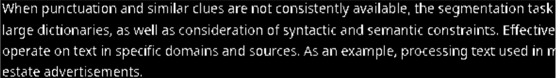
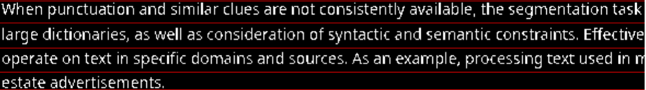
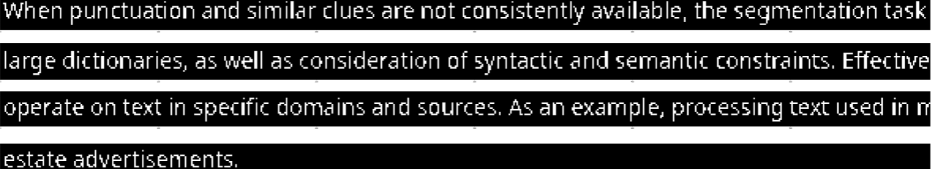
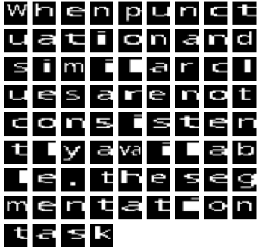

# CharecterSegmentation

Character Segmentation Using projection profile method.

1. Load the image.(thresholding and resizing)
   
     
2. Create horizontal line after horizontal projection profile method.
   
     
3. Seperation of multiple lines of text in image.
   
     
4. Create vertical line after vertical projection profile method.
   
     
5. Seperation of actual characters in image. 
   
